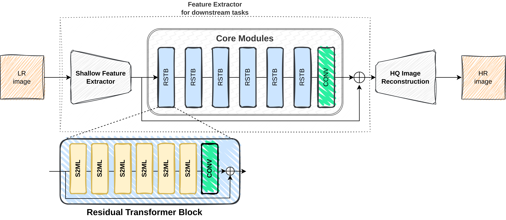
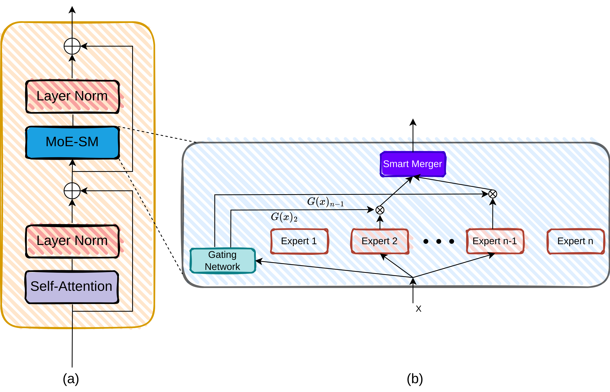
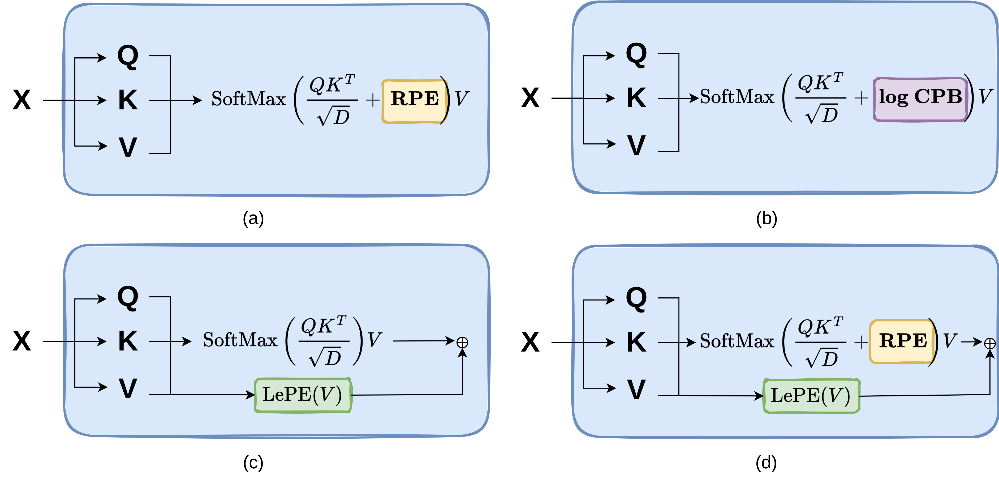

## [Swin2-MoSE: A New Single Image Super-Resolution Model for Remote Sensing](https://arxiv.org/abs/2404.18924)

Official PyTorch implementation of **Swin2-MoSE**.

[](https://paperswithcode.com/sota/multispectral-image-super-resolution-on-1?p=swin2-mose-a-new-single-image-super)
[](https://paperswithcode.com/sota/multispectral-image-super-resolution-on?p=swin2-mose-a-new-single-image-super)
[](https://paperswithcode.com/sota/multispectral-image-super-resolution-on-3?p=swin2-mose-a-new-single-image-super)

In this paper, we propose **Swin2-MoSE** model, an enhanced version of Swin2SR for
Single-Image Super-Resolution for Remote Sensing.







Authors: Leonardo Rossi, Vittorio Bernuzzi, Tomaso Fontanini,
         Massimo Bertozzi, Andrea Prati.

[IMP Lab](http://implab.ce.unipr.it/) -
Dipartimento di Ingegneria e Architettura

University of Parma, Italy


## Abstract

Due to the limitations of current optical and sensor technologies and the high cost of updating them, the spectral and spatial resolution of satellites may not always meet desired requirements.
For these reasons, Remote-Sensing Single-Image Super-Resolution (RS-SISR) techniques have gained significant interest.

In this paper, we propose Swin2-MoSE model, an enhanced version of Swin2SR.

Our model introduces MoE-SM, an enhanced Mixture-of-Experts (MoE) to replace the Feed-Forward inside all Transformer block.
MoE-SM is designed with Smart-Merger, and new layer for merging the output of individual experts, and with a new way to split the work between experts, defining a new per-example strategy instead of the commonly used per-token one.

Furthermore, we analyze how positional encodings interact with each other, demonstrating that per-channel bias and per-head bias can positively cooperate.

Finally, we propose to use a combination of Normalized-Cross-Correlation (NCC) and Structural Similarity Index Measure (SSIM) losses, to avoid typical MSE loss limitations.

Experimental results demonstrate that Swin2-MoSE outperforms SOTA by up to 0.377 ~ 0.958 dB (PSNR) on task of 2x, 3x and 4x resolution-upscaling (Sen2Venus and OLI2MSI datasets).
We show the efficacy of Swin2-MoSE, applying it to a semantic segmentation task (SeasoNet dataset).


## Usage

###  Installation
```bash
$ git clone https://github.com/IMPLabUniPr/swin2-mose/tree/official_code
$ cd swin2-mose
$ conda env create -n swin2_mose_env --file environment.yml
$ conda activate swin2_mose_env
```

### Prepare Sen2Venus dataset

1) After you downloaded the files from
  [Sen2Venus](https://zenodo.org/records/6514159) official website, unzip them
  inside the `./datasets/sen2venus_original` directory.

2) Run the script [split.py](https://github.com/IMPLabUniPr/swin2-mose/tree/official_code/scripts/sen2venus/split.py) to split the dataset in training (~80%) and
   test (~20%):

```bash
python scripts/sen2venus/split.py --input ./datasets/sen2venus_original --output ./data/sen2venus
```

After the successfull execution of the script, you will find `train.csv` and
`test.csv` files inside the `./data/sen2venus`.

Note: if you want to skip this run and use our `train.csv` and `test.csv`
files directly, you can download them from
[Release v1.0](https://github.com/IMPLabUniPr/swin2-mose/releases/tag/v1.0)
page.

3) Run the script [rebuild.py](https://github.com/IMPLabUniPr/swin2-mose/tree/official_code/scripts/sen2venus/rebuild.py) to rebuild the dataset in a compatible
  format:

```bash
python scripts/sen2venus/rebuild.py --data ./datasets/sen2venus_original --output ./data/sen2venus
```

If everything went well, you will have the following files structure:

```
data/sen2venus
├── test
│   ├── 000000_ALSACE_2018-02-14.pt
│   ├── 000001_ALSACE_2018-02-14.pt
|   ...
├── test.csv
├── train
│   ├── 000000_ALSACE_2018-02-14.pt
│   ├── 000001_ALSACE_2018-02-14.pt
|   ...
└── train.csv
```

Note about Sen2venus: we found a small error in file name convention!

On paper, authors wrote for `4x` files, the following:

```
{id}_05m_b5b6b7b8a.pt   -   5m patches (256×256 pix.) for S2 B5, B6, B7 and B8A (from VENµS)
{id}_20m_b5b6b7b8a.pt   -   20m patches (64×64 pix.) for S2 B5, B6, B7 and B8A (from Sentinel-2)
```

But, we found the following name conventions:

```
ALSACE_C_32ULU_2018-02-14_05m_b4b5b6b8a.pt
ALSACE_C_32ULU_2018-02-14_20m_b4b5b6b8a.pt
```

### Prepare OLI2MSI dataset

Download from the
[OLI2MSI](https://github.com/wjwjww/OLI2MSI) official website and unzip it
inside the `./data/oli2msi` directory.

If everything went well, you will have the following files structure:

```
data/oli2msi
├── test_hr
│   ├── L8_126038_20190923_S2B_20190923_T49RCQ_N0071.TIF
│   ├── L8_126038_20190923_S2B_20190923_T49RCQ_N0108.TIF
|   ...
├── test_lr
│   ├── L8_126038_20190923_S2B_20190923_T49RCQ_N0071.TIF
│   ├── L8_126038_20190923_S2B_20190923_T49RCQ_N0108.TIF
|   ...
├── train_hr
│   ├── L8_126038_20190923_S2B_20190923_T49RBQ_N0008.TIF
│   ├── L8_126038_20190923_S2B_20190923_T49RBQ_N0015.TIF
|   ...
└── train_lr
    ├── L8_126038_20190923_S2B_20190923_T49RBQ_N0008.TIF
    ├── L8_126038_20190923_S2B_20190923_T49RBQ_N0015.TIF
    ...
```

### Prepare SeasoNet dataset

Download from the [SeasoNet](https://zenodo.org/records/5850307) official
website and unzip it inside the `./data/SeasoNet/data` directory.

If everything went well, you will have the following files structure:

```
data/SeasoNet
└── data
    ├── fall
    │   ├── grid1
    │   └── grid2
    ├── meta.csv
    ├── snow
    │   ├── grid1
    │   └── grid2
    ├── splits
    │   ├── test.csv
    │   ├── train.csv
    │   └── val.csv
    ├── spring
    │   ├── grid1
    │   └── grid2
    ├── summer
    │   ├── grid1
    │   └── grid2
    └── winter
        ├── grid1
        └── grid2
```

Note about SeasoNet: SeasoNet could be easily downloaded by
[TorchGeo](https://torchgeo.readthedocs.io/en/stable/api/datasets.html#seasonet)
class, specifying the root directory `./data/SeasoNet/data/`.

### Download pretrained

Open
[Release v1.0](https://github.com/IMPLabUniPr/swin2-mose/releases/tag/v1.0)
page and download .pt (pretrained) and .pkl (results) file.

Unzip them inside the output directory, obtaining the following directories
structure:

```
output2/sen2venus_exp4_2x_v5/
├── checkpoints
│   └── model-70.pt
└── eval
    └── results-70.pt
```

### Swin2-MoSE best configuration

```bash
# Sen2Venus 2x
CONFIG_FILE=cfgs/swin2_mose/sen2venus_2x_s2m.yml
# OLI2MSI 3x
CONFIG_FILE=cfgs/swin2_mose/oli2msi_3x_s2m.yml
# Sen2Venus 4x
CONFIG_FILE=cfgs/swin2_mose/sen2venus_4x_s2m.yml
```

### Train

```bash
python src/main.py --phase train --config $CONFIG_FILE --output $OUT_DIR --epochs ${EPOCH} --epoch -1
python src/main_ssegm.py --phase train --config $CONFIG_FILE --output $OUT_DIR --epochs ${EPOCH} --epoch -1
```

### Validate

```bash
python src/main.py --phase test --config $CONFIG_FILE --output $OUT_DIR --batch_size 32 --epoch ${EPOCH}
python src/main.py --phase test --config $CONFIG_FILE --batch_size 32 --eval_method bicubic
```

### Show results

```
python src/main.py --phase vis --config $CONFIG_FILE --output $OUT_DIR --num_images 3 --epoch ${EPOCH}
python src/main.py --phase vis --config $CONFIG_FILE --output output/sen2venus_4x_bicubic --num_images 3 --eval_method bicubic
python src/main.py --phase vis --config $CONFIG_FILE --output output/sen2venus_4x_bicubic --num_images 3 --eval_method bicubic --dpi 1200
python src/main_ssegm.py --phase vis --config $CONFIG_FILE --output $OUT_DIR --num_images 2 --epoch ${EPOCH}
python src/main_ssegm.py --phase vis --config $CONFIG_FILE --output $OUT_DIR --num_images 2 --epoch ${EPOCH} --hide_sr
```

### Compute mean/std

```
python src/main.py --phase mean_std --config $CONFIG_FILE
python src/main_ssegm.py --phase mean_std --config $CONFIG_FILE
```

### Measure execution average time

```
python src/main.py --phase avg_time --config $CONFIG_FILE --repeat_times 1000 --warm_times 20 --batch_size 8
```

### Count total and active number of weights and flops

```
python src/main.py --phase weights --config $CONFIG_FILE
python src/main.py --phase flops --config $CONFIG_FILE
```

## Results

### Table 1

Ablation study on loss usage.

| # | Losses   ||| Performace            ||| Conf |
|:---:|:---:|:---:|:---:|:---:|:---:|:---:|:---:|
| # | **NCC** | **SSIM** | **MSE** | **NCC**    | **SSIM**   | **PSNR**    | |
| 1 | x   |      |     | 0.9550 | 0.5804 | 16.4503 | [conf](cfgs/sen2venus_exp1_v1.yml) |
| 2 |     | x    |     | 0.9565 | 0.9847 | 45.5427 | [conf](cfgs/sen2venus_exp1_v2.yml) |
| 3 |     |      | x   | 0.9546 | 0.9828 | 45.4759 | [conf](cfgs/sen2venus_exp1_v3.yml) |
| 4 | x   | x    |     | 0.9572 | 0.9841 | 45.6986 | [conf](cfgs/sen2venus_exp1_v4.yml) |
| 5 | x   |      | x   | 0.9549 | 0.9828 | 45.5163 | [conf](cfgs/sen2venus_exp1_v5.yml) |
| 6 | x   | x    | x   | 0.9555 | 0.9833 | 45.5542 | [conf](cfgs/sen2venus_exp1_v6.yml) |

### Table 2

Ablation study on positional encoding.

| # | Positional Encoding ||| Performace            || Conf |
|:---:|:---:|:---:|:---:|:---:|:---:|:---:|
| # | **RPE** | **log CPB** | **LePE** | **SSIM**   | **PSNR**    | |
| 1 | x   |         |      | 0.9841 | 45.5855 | [conf](cfgs/sen2venus_exp2_v1.yml) |
| 2 |     | x       |      | 0.9841 | 45.6986 | [conf](cfgs/sen2venus_exp2_v2.yml) |
| 3 |     |         | x    | 0.9843 | 45.7278 | [conf](cfgs/sen2venus_exp2_v3.yml) |
| 4 |     | x       | x    | 0.9845 | 45.8046 | [conf](cfgs/sen2venus_exp2_v4.yml) |
| 5 | x   |         | x    | 0.9847 | 45.8539 | [conf](cfgs/sen2venus_exp2_v5.yml) |
| 6 | x   | x       |      | 0.9843 | 45.6945 | [conf](cfgs/sen2venus_exp2_v6.yml) |
| 7 | x   | x       | x    | 0.9846 | 45.8185 | [conf](cfgs/sen2venus_exp2_v7.yml) |

### Table 3

Ablation study on positional encoding.

| # |         |    | MLP #Params    || Performace            || Latency | Conf |
|:---:|:---:|:---:|:---:|:---:|:---:|:---:|:---:|:---:|
| # | **Arch**    | **SM** | **APC**    | **SPC**     | **SSIM**   | **PSNR**    | (s)     |      |
| 1 | MLP     |    | 32’670 |  32’670 | 0.9847 | 45.8539 | 0.194 | [conf](cfgs/sen2venus_exp3_v1.yml) |
| 2 | MoE  8/2 |    | 33’480 | 131’760 | 0.9845 | 45.8647 | 0.223 | [conf](cfgs/sen2venus_exp3_v2.yml) |
| 3 | MoE  8/2 | x  | 33'499 | 131’779 | 0.9849 | 45.9272 | 0.229 | [conf](cfgs/sen2venus_exp3_v3.yml) |
|:---:|:---:|:---:|:---:|:---:|:---:|:---:|:---:|:---:|
| 4 | MoE  8/1 | x  | 34'120 | 262’810 | 0.9837 | 45.4847 | 0.230 | [conf](cfgs/sen2venus_exp3_v4.yml) |
| 5 | MoE  6/2 | x  | 33'319 |  98’839 | 0.9844 | 45.8328 | 0.230 | [conf](cfgs/sen2venus_exp3_v5.yml) |
| 6 | MoE  8/2 | x  | 33'499 | 131’779 | 0.9849 | 45.9272 | 0.229 | [conf](cfgs/sen2venus_exp3_v3.yml) |
| 7 | MoE 10/2 | x  | 33'679 | 164’719 | 0.9846 | 45.8913 | 0.230 | [conf](cfgs/sen2venus_exp3_v7.yml) |

### Table 4

Quantitative comparison with SOTA models on Sen2Veµs and OLI2MS datasets.

| # | Model             |  Sen2Venus 2x   || OLI2MSI 3x      || Sen2Venus 4x    || Conf |||
|:---:|:---:|:---:|:---:|:---:|:---:|:---:|:---:|:---:|:---:|:---:|
| # |                   | **SSIM**   | **PSNR**    | **SSIM**   | **PSNR**    | **SSIM**   | **PSNR**    | **2x** | **3x** | **4x** |
| 1 | Bicubic           | 0.9883 | 45.5588 | 0.9768 | 42.1835 | 0.9674 | 42.0499 |    |    |    |
| 2 | [SwinIR](https://openaccess.thecvf.com/content/ICCV2021W/AIM/html/Liang_SwinIR_Image_Restoration_Using_Swin_Transformer_ICCVW_2021_paper.html)            | 0.9938 | 48.7064 | 0.9860 | 43.7482 | 0.9825 | 45.3460 | [conf](cfgs/sen2venus_exp4_2x_v2.yml) | [conf](cfgs/oli2msi_exp4_3x_v2.yml) | [conf](cfgs/sen2venus_exp4_4x_v2.yml) |
| 3 | [Swinfir](https://arxiv.org/abs/2208.11247)           | 0.9940 | 48.8532 | 0.9863 | 44.4829 | 0.9830 | 45.5500 | [conf](cfgs/sen2venus_exp4_2x_v3.yml) | [conf](cfgs/oli2msi_exp4_3x_v3.yml) | [conf](cfgs/sen2venus_exp4_4x_v3.yml) |
| 4 | [Swin2SR](https://link.springer.com/chapter/10.1007/978-3-031-25063-7_42)           | 0.9942 | 49.0467 | 0.9881 | 44.9614 | 0.9828 | 45.4759 | [conf](cfgs/sen2venus_exp4_2x_v4.yml) | [conf](cfgs/oli2msi_exp4_3x_v4.yml) | [conf](cfgs/sen2venus_exp4_4x_v4.yml) |
| 5 | [DAT](https://openaccess.thecvf.com/content/ICCV2023/html/Chen_Dual_Aggregation_Transformer_for_Image_Super-Resolution_ICCV_2023_paper.html) | 0.9946 | 49.4699 | 0.9886 | 45.0404 | 0.9837 | 45.8053 | [conf](cfgs/sen2venus_exp4_2x_v5.yml) | [conf](cfgs/oli2msi_exp4_3x_v5.yml) | [conf](cfgs/sen2venus_exp4_4x_v5.yml) |
| 6 | Swin2-MoSE (ours) | 0.9948 | 49.4784 | 0.9912 | 45.9194 | 0.9849 | 45.9272 | [conf](cfgs/sen2venus_exp4_2x_v6.yml) | [conf](cfgs/oli2msi_exp4_3x_v6.yml) | [conf](cfgs/sen2venus_exp4_4x_v6.yml) |


### Figure 11

Results for the Semantic Segmentation task on SeasoNet dataset.

| # | Model             |  Conf |
|:---:|:---:|:---:|
| 1 | FarSeg            | [conf](cfgs/seasonet_exp5_v1.yml) |
| 2 | FarSeg++          | [conf](cfgs/seasonet_exp5_v2.yml) |
| 3 | FarSeg+S2MFE      | [conf](cfgs/seasonet_exp5_v3.yml) |

## License

See [GPL v2](./LICENSE) License.

## Acknowledgement

Project ECS\_00000033\_ECOSISTER funded under the National Recovery and Resilience Plan (NRRP), Mission 4
Component 2 Investment 1.5 - funded by the European Union – NextGenerationEU.
This research benefits from the HPC (High Performance Computing) facility of the University of Parma, Italy.

## Citation
If you find our work useful in your research, please cite:

```
@article{rossi2025swin2,
  title={Swin2-MoSE: A new single image supersolution model for remote sensing},
  author={Rossi, Leonardo and Bernuzzi, Vittorio and Fontanini, Tomaso and Bertozzi, Massimo and Prati, Andrea},
  journal={IET Image Processing},
  volume={19},
  number={1},
  pages={e13303},
  year={2025},
  publisher={Wiley Online Library}
}
```
